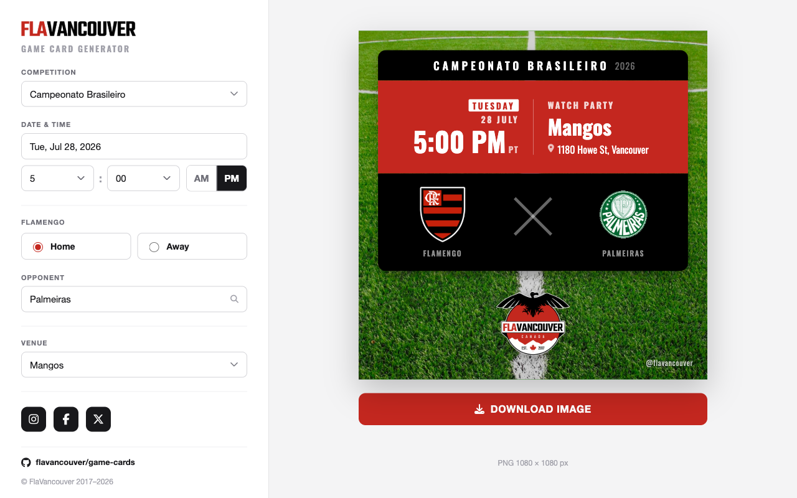

# FlaVan Game Card Generator

A fully client-side web app that generates square **1080 × 1080** match graphics for
**FlaVancouver** — the Vancouver-based Flamengo supporters' club. Fill in the match details,
watch a live 1:1 preview update as you type, and download a high-quality PNG ready for
Instagram / Facebook / X.

**Live:** <https://flavancouver.github.io/game-cards/>

## About

The app produces the club's standard watch-party graphic in a few clicks. You pick the
competition, date and time, venue, home/away, and opponent — everything else (the layout,
crests, weekday chip, timezone, year, and filename) is derived automatically, and the preview
mirrors the exported image exactly.

Highlights:

- **Live preview** — every field updates the card instantly; no "apply" step.
- **Searchable opponent picker** with 70+ team crests, accent-insensitive (typing `sao`
  finds "São Paulo"), plus an "Other" option for teams not on the list.
- **Home / away** swaps which side each team sits on; Flamengo's crest always reads larger.
- **Custom date popover** limited to a sensible range (today through six months out).
- **Full-resolution export** — the on-screen preview is scaled down, but the downloaded PNG
  is always a true 1080 × 1080.

## How it works

- **`index.html`** — the entire app: markup, styles, and logic in one file.
- **`assets/`** — background photo, club badge, and editor wordmark.
- **`crests/`** — team crest PNGs (transparent, trimmed to content), named `<key>.png`.

The card is authored at a fixed **1080 × 1080** canvas and CSS-scaled down for the preview.
Export renders that same element at true resolution via
[html-to-image](https://github.com/bubkoo/html-to-image), so the download is always full
quality regardless of the on-screen size. Teams without a crest file (`remo`,
`union-la-calera`) render an initials badge instead — to add artwork later, drop
`crests/<key>.png` in place and remove the key from the `NO_CREST` set in `index.html`.

Three dependencies load from CDNs: Google Fonts (Oswald), Font Awesome 6.5.2, and
html-to-image 1.11.11. Everything runs in the browser — no backend, no database, no API keys.

## Deployment

The site is hosted on **GitHub Pages**, served straight from this repository's `main` branch
(root). It's a static site with no build step, so **any push to `main` republishes the live
site automatically** within a minute or so.

The Pages configuration lives under **Settings → Pages → Build and deployment → Source:
_Deploy from a branch_ → Branch: `main` / `/ (root)`**. GitHub Pages is free for public
repositories, which is why this repo is public.

## Asset licensing note

Club crests are trademarks. This is fine for a small supporters'-club tool, but keep it in
mind before promoting the app more broadly.

---

© FlaVancouver 2017–present
